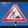
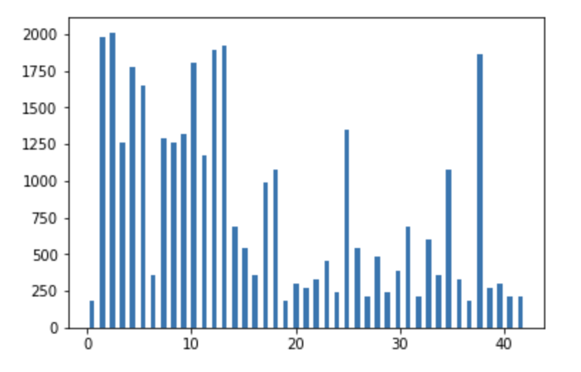
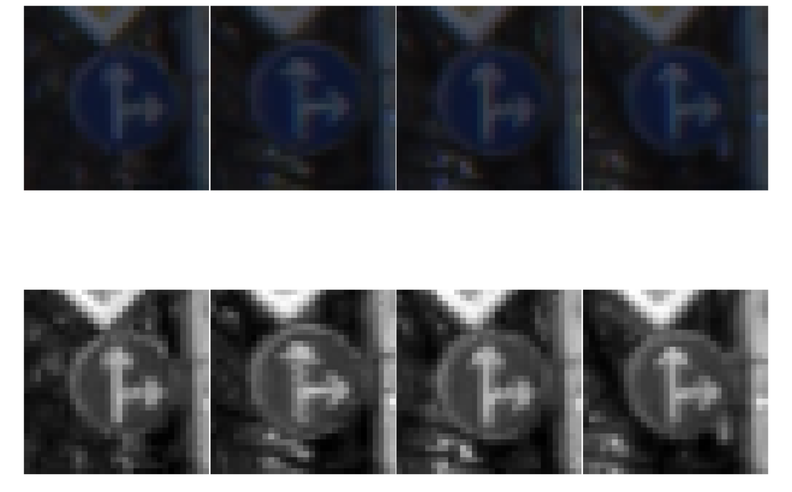

# **Traffic Sign Recognition** 

## Writeup

### The second project for the first term of the Self Driving Cars. In this project we are going to make and train a deep neural network to recognize the german traffic signs dataset.

---

**Build a Traffic Sign Recognition Project**

The goals / steps of this project are the following:
* Load the data set 
Loading the data set from the pickle files into Train, Valid and Test Datasets. Then i count the number of data in each set, and the corresponding shapes.
Result:
```
X_train shape: (34799, 32, 32, 3)
y_train shape: (34799,)
X_valid shape: (4410, 32, 32, 3)
y_valid shape: (4410,)
X_test shape: (12630, 32, 32, 3)
y_test shape: (12630,)

Image data shape = (32, 32, 3)
Number of classes = 43
```
* Explore, summarize and visualize the data set
```
The pickled data is a dictionary with 4 key/value pairs:

'features' is a 4D array containing raw pixel data of the traffic sign images, (num examples, width, height, channels).
'labels' is a 1D array containing the label/class id of the traffic sign. The file signnames.csv contains id -> name mappings for each id.
'sizes' is a list containing tuples, (width, height) representing the original width and height the image.
'coords' is a list containing tuples, (x1, y1, x2, y2) representing coordinates of a bounding box around the sign in the image. 

Then i took some images and diplay them along with the tags. One can also cross check from the signnames.csv

Then i did some alalysis to show the type of sign versus frequency, typically a histogram.
```
* Design, train and test a model architecture

Before designing the architecute, i preprocessed the Data
```
1. Convert to the grayscale
2. Normalize the data
```
Architecture
| Layer        | Description  |
| ------------- |:-----:|
| Input     | (32, 32, 1) grayscale image |
| convolution 1     | 1,1 stride, padding "valid", output 28*28*6 |
| Relu |  |
|Max Pooling| 2,2 kernel, 2,2 stride, padding "valid"|
|convolution 2| 1,1 stride, padding "valid", output 10*10*16|
|Relu||
|Max pooling| 2,2 kernel, 2,2 stride, padding "valid"|
|flatten| output 400|
|convolution 3, fully connected| ouput 84|
|Relu||
|dropout||
|fully connected| output 43|

* Use the model to make predictions on new images
Then i downloaded some images from the internet, it worked well with the 43 classes, but one new class as apparent, it showed error, with suggestions
* Analyze the softmax probabilities of the new images
```
Between the bumpy road and the slippery road, it was tough competition but success
```
* Summarize the results with a written report

done


[//]: # (Image References)

 "speed limit 30"
 "bumpy road"
 "go ahead"
 "no entry"
 "left or straight"
 "caution"
 "road works"
 "no motorarized vehicles"

## Rubric Points
### Here I will consider the [rubric points](https://review.udacity.com/#!/rubrics/481/view) individually and describe how I addressed each point in my implementation.  

---
### Writeup / README

#### 1. Provide a Writeup / README that includes all the rubric points and how you addressed each one. You can submit your writeup as markdown or pdf. You can use this template as a guide for writing the report. The submission includes the project code.

You're reading it! and here is a link to my [project code](https://github.com/a-chauhan/CarND-Traffic-Sign-Classifier-Project/blob/master/Traffic_Sign_Classifier.ipynb)

### Data Set Summary & Exploration

#### 1. Provide a basic summary of the data set. In the code, the analysis should be done using python, numpy and/or pandas methods rather than hardcoding results manually.

I used the pandas library to calculate summary statistics of the traffic
signs data set:

* The size of training set is 34799
* The size of the validation set is 4410
* The size of test set is 12630
* The shape of a traffic sign image is 32, 32, 3
* The number of unique classes/labels in the data set is 43

X_train shape: (34799, 32, 32, 3)
y_train shape: (34799,)
X_valid shape: (4410, 32, 32, 3)
y_valid shape: (4410,)
X_test shape: (12630, 32, 32, 3)
y_test shape: (12630,)

Image data shape = (32, 32, 3)
Number of classes = 43

#### 2. Include an exploratory visualization of the dataset.

Here is an exploratory visualization of the data set. It is a bar chart showing how the data ...



### Design and Test a Model Architecture

#### 1. Describe how you preprocessed the image data. What techniques were chosen and why did you choose these techniques? Consider including images showing the output of each preprocessing technique. Pre-processing refers to techniques such as converting to grayscale, normalization, etc. (OPTIONAL: As described in the "Stand Out Suggestions" part of the rubric, if you generated additional data for training, describe why you decided to generate additional data, how you generated the data, and provide example images of the additional data. Then describe the characteristics of the augmented training set like number of images in the set, number of images for each class, etc.)

As a first step, I decided to convert the images to grayscale because ...

Here is an example of a traffic sign image before and after grayscaling.



As a last step, I normalized the image data because to reduce the noise


#### 2. Describe what your final model architecture looks like including model type, layers, layer sizes, connectivity, etc.) Consider including a diagram and/or table describing the final model.

My final model consisted of the following layers:

| Layer        | Description  |
| ------------- |:-----:|
| Input     | (32, 32, 1) grayscale image |
| convolution 1     | 1,1 stride, padding "valid", output 28*28*6 |
| Relu |  |
|Max Pooling| 2,2 kernel, 2,2 stride, padding "valid"|
|convolution 2| 1,1 stride, padding "valid", output 10*10*16|
|Relu||
|Max pooling| 2,2 kernel, 2,2 stride, padding "valid"|
|flatten| output 400|
|convolution 3, fully connected| ouput 84|
|Relu||
|dropout||
|fully connected| output 43|


#### 3. Describe how you trained your model. The discussion can include the type of optimizer, the batch size, number of epochs and any hyperparameters such as learning rate.

To train the model, I used an the following:
```
adamoptimizer with learning rate = 0.0012
EPOCHS = 50
BATCH_SIZE = 128
mu = 0
sigma = 0.1
keep_prob = 0.5 for training and 1 for validation
```

#### 4. Describe the approach taken for finding a solution and getting the validation set accuracy to be at least 0.93. Include in the discussion the results on the training, validation and test sets and where in the code these were calculated. Your approach may have been an iterative process, in which case, outline the steps you took to get to the final solution and why you chose those steps. Perhaps your solution involved an already well known implementation or architecture. In this case, discuss why you think the architecture is suitable for the current problem.

My final model results were:
* validation set accuracy of = 0.955
* test set accuracy of = 0.936

If an iterative approach was chosen:
* What were some problems with the initial architecture?
Initially, i did not have the normalization and dropout layer, introducing these greatly affected the accuracy. Tuning the parameters helped also, Validation accuracy upto 0.89 was easy, beyond that it took tuning the parameters.
* Which parameters were tuned? How were they adjusted and why? learning rate to 0.0012 and keep_prob to 0.5
* What are some of the important design choices and why were they chosen? For example, why might a convolution layer work well with this problem? How might a dropout layer help with creating a successful model?
Dropout layer makes it more flexible, and does not overfit the NN.
 

### Test a Model on New Images

#### 1. Choose five German traffic signs found on the web and provide them in the report. For each image, discuss what quality or qualities might be difficult to classify.

Here are few German traffic signs that I found on the web:

 "speed limit 30"
 "bumpy road"
 "go ahead"
 "no entry"
 "left or straight"
 "caution"
 "road works"
 "no motorarized vehicles"

Work ahead and bumpy road were mistaken during the training because of double spikes
Also, The last image might be difficult to classify because it is not in the 43 cases.

#### 2. Discuss the model's predictions on these new traffic signs and compare the results to predicting on the test set. At a minimum, discuss what the predictions were, the accuracy on these new predictions, and compare the accuracy to the accuracy on the test set (OPTIONAL: Discuss the results in more detail as described in the "Stand Out Suggestions" part of the rubric).

Here are the results of the prediction:

| Image			        |     Prediction	        					| 
|:---------------------:|:---------------------------------------------:| 
| Speed limit 30     		| Speed limit 30   									| 
| Bumpy road     			| Bumpy road 										|
| go ahead					| go ahead										|
| no entry	      		| no entry					 				|
| left or straight			| left or straight      							|
| caution | caution |
|road works | road works|
| motorized vehicle restriction | no entry|


The model was able to correctly guess 7 of the 8 traffic signs, which gives an accuracy of 80%. This compares favorably to the accuracy on the test set of 0.875

#### 3. Describe how certain the model is when predicting on each of the five new images by looking at the softmax probabilities for each prediction. Provide the top 5 softmax probabilities for each image along with the sign type of each probability. (OPTIONAL: as described in the "Stand Out Suggestions" part of the rubric, visualizations can also be provided such as bar charts)

The code for making predictions on my final model is located in the 23trd cell of the Ipython notebook.

For the first image, the model is relatively sure that this is a stop sign (probability of 0.6), and the image does contain a stop sign. The top five soft max probabilities were

```

```


